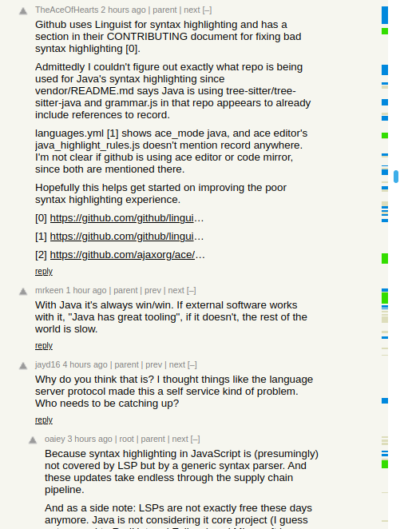
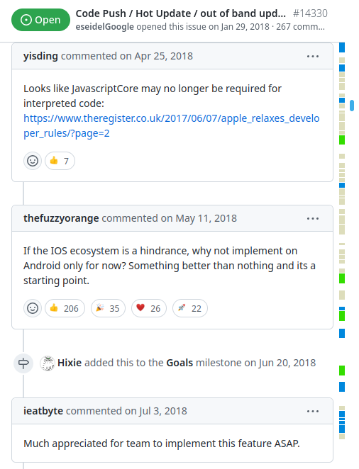

# CommentGutter

Chrome extension to show clickable marks along the scrollbar for potential comments of interest on:
* `news.ycombinator.com` comment pages,
* `old.reddit.com` comment pages,
* `github.com` comment pages.

| Mark | Meaning |
| --- | --- |
| 🔵 Blue  | Comment with link(s) |
| 🟢 Green  | Big comment _, >1000 raw characters_ |
| Gray | Top level comment |

Lighter green or blue is for nested (response) comments.

If comments are collapsed/expanded or changed, the gutter will refresh. 

## Usage

Click a gutter mark to scroll to that comment.

## Installation

### From source

1. Clone or download the repository: `git clone https://github.com/alex-vt/CommentGutter.git`

2. In Chrome: 3-dot menu -> `More tools` -> `Extensions`. Enable `Developer Mode`.

3. Click `Load unpacked` and select `CommentGutter` folder of the repository.

Note: The gutter may not show up on the already opened comment pages at first after installation, in this case reload them.

## License

[MIT](LICENSE) license.
